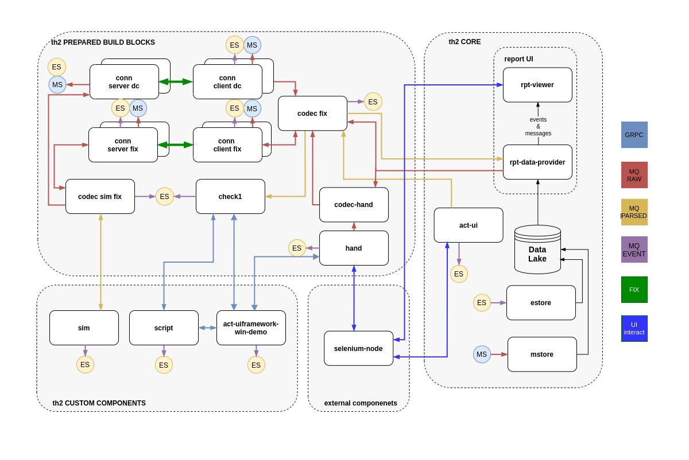

## Version 1.5.4 - scenario with interacting with UI via hand ##

This version based on [infra 1.5.4](https://github.com/th2-net/th2-infra/tree/release-v1.5.4)


### Scenario execution:
For the proper scenario execution, it is necessary have configured access to web components via HTTPS protocol. Browser (via javascript) has access to clipboard only for HTTPS pages.

Node with browser can be used in scenario execution. Address is configured in hand node:
```yaml
  custom-config:
    driversMapping:
      chrome-node-1:
        type: "web"
        url: "http://selenium-chrome:8080"
```
Here `selenium-chrome` is node address (node name) that can be only accessible from k8s. `chrome-node-1` is session name and will be specified in script.

### Execution steps:
ℹ️  **Instructions to launch applications outside the cluster(ExternalBox functionality):** https://github.com/th2-net/th2-documentation/wiki/Connecting-external-box-to-cluster-using-kubectl
1. **Create new namespace using CRs from this branch** (please find general information about namespace creation below).
2. **Configure act-ui-backend:**\
    Replace `<namespace>` with real namespace name in *schemaDefinitionLink* and *schemaDescriptorsLink* in file `core/act-ui-backend.yml`
3. **Configure ingress rules:**
    1. Rule to connect act-ui and act-ui-backend
    1. Rule to access components (act-ui, rpt-viewer) via HTTPS protocol
4. **Change URL to act-ui in act-uiframework-web box:**\
    An example:
```yaml
  custom-config:
    act_url: 'https://cluster-ip:30443/th2-hand-web-154/act-ui/'
```
5. **Launch the test script.**

    **Test script**: https://github.com/th2-net/th2-demo-script/tree/ver-1.5.4-hand-web-scenario 


## Environment schema



# General information about configuring Schema #

Schema can be configured to be deployed to kubernetes and managed by infra manager.
Behaviour is controlled by `k8s-propagation` property in the `infra-mgr-config.yml` file.
These are the possible values for this property:

- `off`  - No synchronization will be done
- `deny` - No synchronization will be done and associated namespace will be removed from the kubernetes
- `sync` - Synchronizes repository changes with kubernetes
- `rule` - Synchronizes repository changes with kubernetes. Also monitors resource changes in kubernetes and 
         brings them back to repository state
  
## Creating new namespace
1) Create a new branch based on master
2) Make all the wanted changes in the `CRs`.
3) If you want to add new component make sure to include it in `links-live.yml`, `dictionary-links.yml`, `codec-links.yml` (if needed) link files are placed in `links` directory.
4) If you are going to have several namespaces together, make sure to assign each component in each namespace with unique `nodePort`. (nodePorts must be unique across the namespaces too)components that require `nodePort` are: `rpt-data-provider`, `rpt-data-viewer`, `act`, `check1`. Following ports are reserved by th2-infra: `rmq ampq protocol: 32000`, `cassandra cql: 32010`, `ingress: 30000`.
5) Make sure that `k8s-propagation` property in `infra-mgr-config.yml` file is set to `sync` (only branches that have this property set to `sync` or `rule` will be deployed by infra manager).
6) commit all new branch to `git`. (After committing new namespace will be created automatically, it might take 20-40 seconds)

## Restarting existing namespace
There are two methods to restart the namespace

**Repository only method**
1) set `k8s-propagation` property to `deny` in `infra-mgr-config.yml`. Namespace will be deleted by infra manager during 30-60 secs.
2) set `k8s-propagation` property to `sync` or `rule` in `infra-mgr-config.yml`. Schema will be deployed by infra manager during 30-60 secs.

**Involving kubernetes**
1) set `k8s-propagation` property in `infra-mgr-config.yml` to `rule` and commit this change.
2) delete an existing namespace using `kubectl delete namespace NAMESPACE_NAME` command. Schema will be redeployed automatically after 30-60 secs

## Restarting single component
in order to restart single component just delete `pod` of that specific component using `kubectl delete pod POD_NAME -n POD_NAMESPACE` command or using kubernetes dashboard (if you have necessary privileges). After deleting, `pod` will be recreated automatically.  

